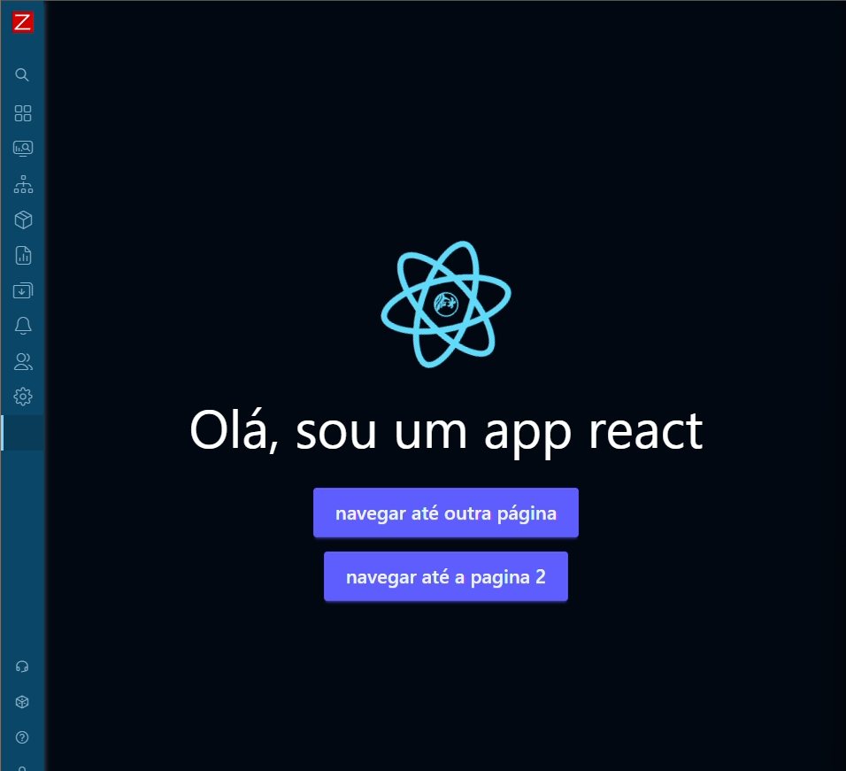

<h1 align="center">React + Android + TV + Zabbix Módulo</h1>

## Sobre

Esse projeto consiste em usar uma única base de código `React` para criar aplicativos `Android` que funcionam tanto em `dispositivos móveis quanto em TVs`. Além disso, também visa ser capaz de rodar no `zabbix` via [módulo](https://www.zabbix.com/documentation/current/en/devel/modules).

Tudo isso com uma única manutenção de código, aproveitando o poder do `React` e suas bibliotecas associadas e tecnologias modenas como `tailwindcss` para estilização e `tanstack query` para gerenciamento de estado e dados.

## Créditos importantes

Créditos ao `Thiago Santos`, pela configuração base do Zabbix via Docker-Compose: [Repositório](https://github.com/zthiagosantos/zbx-server-docker). A partir dele foi possível montar o ambiente de desenvolvimento para o módulo Zabbix.

- [GitHub - Thiago Santos](https://github.com/zthiagosantos)
- [Linkedin - Thiago Santos](https://www.linkedin.com/in/thiago-souza-694057212)

## Como funciona?

Com React, nosso primeiro passo é escrever nosso sistema normalmente fazendo uso de bibliotecas modernas como `tailwindcss` para estilização e `tanstack query` para gerenciamento de estado e dados.

Em adição, usando [Norigin Spatial Navigation](https://github.com/NoriginMedia/Norigin-Spatial-Navigation) podemos garantir que a navegação por controle remoto em TVs funcione perfeitamente.

Você vai notar que isso posto, naturalmente, a próxima missão é fazer um app Android que funcione tanto em dispositivos móveis quanto em TVs. Para isso, usamos `app nativo` com `WebView` para embutir nossa aplicação React. Aliado a navegação espacial, isso garante que o app funcione perfeitamente em ambos os tipos de dispositivos.

Dai, podemos usar o nosso site React em um módulo Zabbix. O Zabbix permite a criação de módulos personalizados que podem ser integrados ao sistema. A vantagem dessa abordagem é aproveitar todo o processo de `CI/CD`, `testes` e `manutenção` já estabelecidos para a aplicação React, reduzindo o esforço necessário para manter o módulo Zabbix atualizado, pois ele simplesmente carrega a aplicação React existente.

## Benefícios

- **Manutenção Unificada**: Com uma única base de código, as atualizações e correções são feitas uma vez, beneficiando todas as plataformas.
- **Consistência de UI/UX**: A experiência do usuário permanece consistente em todas as plataformas.
- **Redução de Custos**: Menos tempo e recursos gastos em desenvolvimento e manutenção.
- **Aproveitamento de Tecnologias Modernas**: Uso de bibliotecas e frameworks modernos para garantir desempenho e escalabilidade.
- **Flexibilidade**: Facilidade para adicionar novas funcionalidades que funcionem em todas as plataformas.
- **Integração com Zabbix**: Capacidade de rodar a aplicação React como um módulo Zabbix, aproveitando a infraestrutura existente.

## Conclusão

Esse projeto demonstra como é possível usar o poder do React para criar aplicações que funcionam perfeitamente em múltiplas plataformas, incluindo Android (móveis e TVs) e Zabbix, tudo isso com uma única base de código. Isso não só simplifica o desenvolvimento e a manutenção, mas também garante uma experiência de usuário consistente e de alta qualidade.
